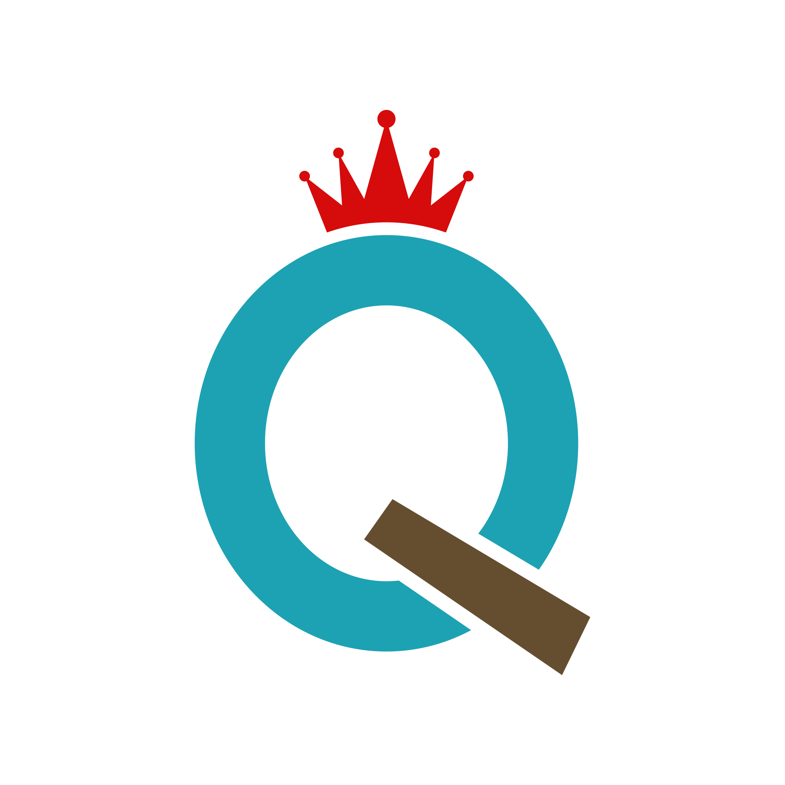
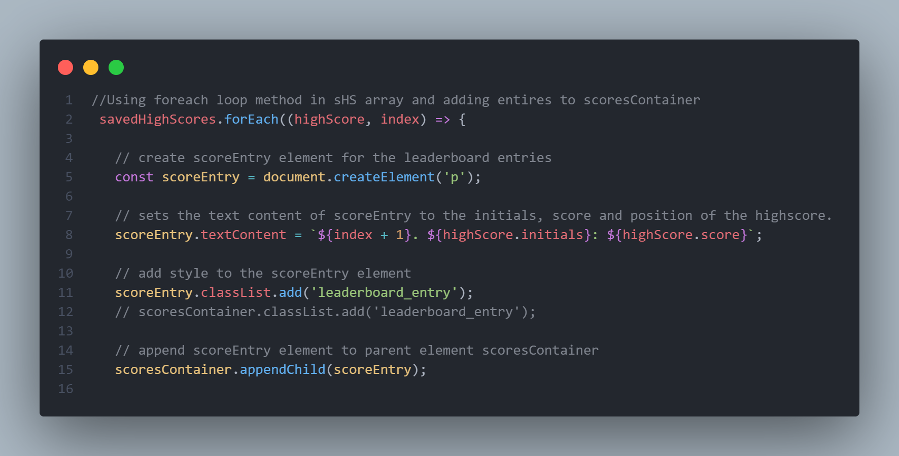
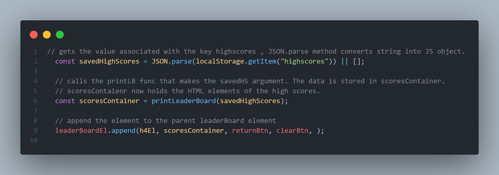
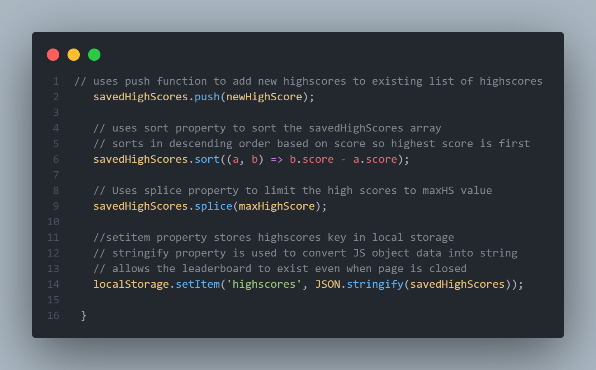

<a name="readme-top"></a>


<!-- PROJECT LOGO -->
<br />
<div align="center">
  <a href="https://github.com/sbanati/Quiz">  
    
  </a>

<h1 align="center">Code Quiz Pro</h1>

  <p align="center">
    A coding quiz with a polished and responsive design. HTML and CSS powered by JavaScript 
    <br />
    <a href="https://github.com/sbanati/Quiz"><strong>Explore the docs »</strong></a>
    <br />
    <br />

    
  <a href="https://sbanati.github.io/CodeQuizPro/">View Demo</a>
    
  

  </p>
</div>


<!-- TABLE OF CONTENTS -->
<details>
  <summary>Table of Contents</summary>
  <ol>
    <li>
      <a href="#about-the-project">About The Project</a>
      <ul>
        <li><a href="#built-with">Built With</a></li>
      </ul>
    </li>
    <li>
      <a href="#getting-started">Getting Started</a>
      <ul>
        <li><a href="#installation">Installation</a></li>
      </ul>
    </li>
    <li><a href="#usage">Usage</a></li>
    <li><a href="#code-explanation">Code-Explanation</a></li>
    <li><a href="#additions">Additions</a></li>
    <li><a href="#contributing">Contributing</a></li>
    <li><a href="#acknowledgement">Acknowledgement</a></li>
    <li><a href="#contact">Contact</a></li>
  </ol>
</details>


<!-- ABOUT THE PROJECT -->
## About The Project

This project is a Web API challenge where I was tasked with designing a fully responsive quiz. The specifics were to build a timed multiple choice quiz while using DOM manipulation via JavaScript to dynamically update HTML and CSS.
<br><br>


<p align="right">(<a href="#readme-top">back to top</a>)</p>


### Built With

* [](https://img.shields.io/badge/HTML5-E34F26?style=for-the-badge&logo=html5&logoColor=white)
* [](https://img.shields.io/badge/CSS3-1572B6?style=for-the-badge&logo=css3&logoColor=white)
* [](https://img.shields.io/badge/JavaScript-323330?style=for-the-badge&logo=javascript&logoColor=F7DF1E)


<p align="right">(<a href="#readme-top">back to top</a>)</p>


<!-- GETTING STARTED -->
## Getting Started

 <h3>For end users</h3> 
https://sbanati.github.io/CodeQuizPro/  <br>


### Installation
For anyone wanting to contribute <br>

1. Clone the repo
   ```sh
   git clone https://github.com/sbanati/Quiz.git
   ```

<p align="right">(<a href="#readme-top">back to top</a>)</p>


<!-- USAGE EXAMPLES -->
## Usage

<h3>gif of the Code Quiz Pro. You can see the user going through each part of the quiz.</h3>


<br>
<br>


 

<p align="right">(<a href="#readme-top">back to top</a>)</p>

<br>
<br>
<!-- CODE EXPLANATION -->

## Code Explanation
<br> This section will explain some code snippets that I had to do additional research on outside of class to implement. 
<br>
### Example 1: Function printLeaderBoard 


<br>


This function takes the savedHighScores as a param.<br>


<strong>savedHighScores.forEach((highScore, index) => <strong> <br>
<br>
The savedHighScore is an array in which every element within the array has a specific high score. I use the forEach method in JavaScript to interact with each highscore as a separate list item. Everytime the loop repeats, the highScore represents the current score element and the index is the position of the score element within the array. The Arrow function that comes at the end of the line is simply saying to apply the following lines of code to each element in the array. In this case, print the position, initials and score content. This is completed by first creating scoreEntry var that prints in a paragraph element. scoreEntry is then set to get the text content and then styled and appended to the scoreContainer. 

<br>

### Example 2: Function leaderBoard

<br>
This code snippet is from the function leaderBoard. For context the lines above this code snippet are simply manipulating the DOM elements. <br>
<strong>const savedHighScores = JSON.parse(localStorage.getItem("highscores")) || [];<strong> <br>
The localStorage.getItem gets teh data stored in the highscores key from local storage.
The parse method is used to convert the data from string to a JavaScript object. The reason the || []; OR operator and then empty array are present is to ensure if there is an issue in data retrieval from local storage or parsing an empty value, there is a fall back.
Without this, a parsing error could occur resulting in aa code break. <br>

### Example 3: Function saveHighScores <br>
<br>
This code snippet is from the Function saveHighScores. Its purpose is to add new highscores to the existing leaderboard list, sort the scores from highest value to lowest value, and create a limit of top 20 to the leaderboard. <br>

I want to focus on the following 4 lines of code. <br>
By using the push method we can add a new high score entry to the array of the currently existing highscores. Then we can use the sort method to arrange the highscores from descending order, ensuring the highest value will be rank 1.
Then the splice method is used to cut the array length to the desired value, in this case maxHighScore is set to 20. Lastly the setItem method is used to store the updated highscores from above into local store in the same key highscores. We use the stringify 
method to convert the JS objects into strings. Local storage can only store strings. Now when the quiz is exited and re-entered, the leaderboard data will persist unless cleared. 


<p align="right">(<a href="#readme-top">back to top</a>)</p>


<!-- ROADMAP -->
## Additions

<h3>Possible features</h3>

* Adding more questions 
  


<p align="right">(<a href="#readme-top">back to top</a>)</p>


<!-- CONTRIBUTING -->
## Contributing

This part of the readme is where community involvement can happen! Normally I would have my Github setup to where anyone can fork and push or make an issue, but 
I am still learning that stuff. In the mean time this is how the section would look like. Pretty much from the Template. <br>

Contributions are what make the open source community such an amazing place to learn, inspire, and create. Any contributions you make are **greatly appreciated**.
If you have a suggestion that would make this better, please fork the repo and create a pull request. You can also simply open an issue with the tag "enhancement".


1. Fork the Project
2. Create your Feature Branch (`git checkout -b feature/NewFeature`)
3. Commit your Changes (`git commit -m 'Added some Goated new feature'`)
4. Push to the Branch (`git push origin feature/NewFeature`)
5. Open a Pull Request

<p align="right">(<a href="#readme-top">back to top</a>)</p>


<!-- ACKNOWLEDGEMENT -->
## Acknowledgement
* Worked with Jason to compare and contrast our projects and see differing methods. 


<p align="right">(<a href="#readme-top">back to top</a>)</p>


<!-- CONTACT -->
## Contact

Your Name - [@twitter_TherealSLVR](https://twitter.com/TherealSLVR) - smbanati@gmail.com

Project Link: https://github.com/sbanati/Quiz

<p align="right">(<a href="#readme-top">back to top</a>)</p>


<!-- MARKDOWN LINKS & IMAGES -->
<!-- https://www.markdownguide.org/basic-syntax/#reference-style-links -->
References:
* Tutoring session with Jose Lopez. He told me to focus on DOM manipulation. We worked on the initiate quiz function and show question function together and I used those as framework for dynamic DOM manipulation.
* consulted Xpert Learning Assisst when stuck or needed help with next steps  or research. Consulted it for research to explain what methods I can use and how to apply them. 
* Used BSC learning assisstant when all else failed and was HARD STUCK 
